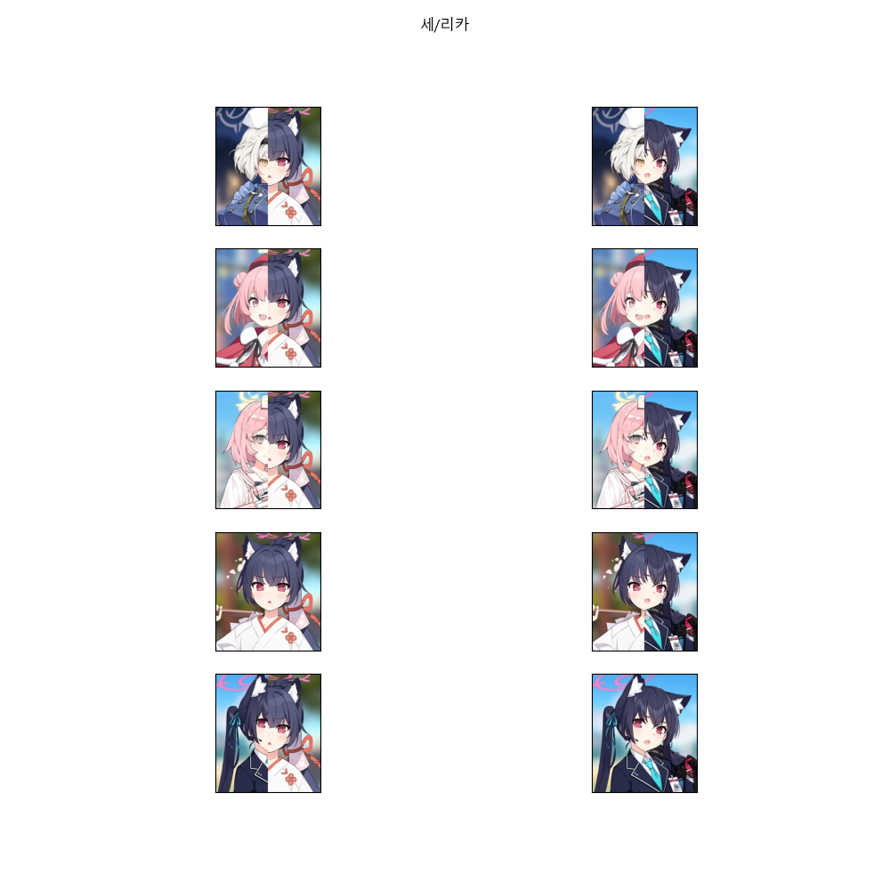

# BA-Fusion

# Prerequisites
* Python3

Also, download required libraries as below:
```
pip install pillow
```

# Usage
```
python main.py 제작할_학생_이름
```

# Example
### Run
```
$ python main.py 세리카
```

### Shell Output
```
loaded 156 students
We have 5 students starts with "세" ['세나', '세리나(크리스마스)', '세리나', '세리카(새해)', '세리카']
We have 2 students ends with "리카" ['세리카(새해)', '세리카']
100% ███████████████████████████████████████████████████████████████████████████████████████████████████████████████████████████████████████████████████████████████████████████████████████████████████████████████████████████████████████████████| 5/5 [00:00<00:00, 24.33it/s]
We have 4 students starts with "세리" ['세리나(크리스마스)', '세리나', '세리카(새해)', '세리카']
We have 11 students ends with "카" ['노도카(온천)', '노도카', '미카', '세리카(새해)', '세리카', '유우카(체육복)', '유우카', '하루카(새해)', '하루카', '후우카(새해)', '후우카']
100% ███████████████████████████████████████████████████████████████████████████████████████████████████████████████████████████████████████████████████████████████████████████████████████████████████████████████████████████████████████████████| 4/4 [00:00<00:00, 13.69it/s]
```

### Generated Images


